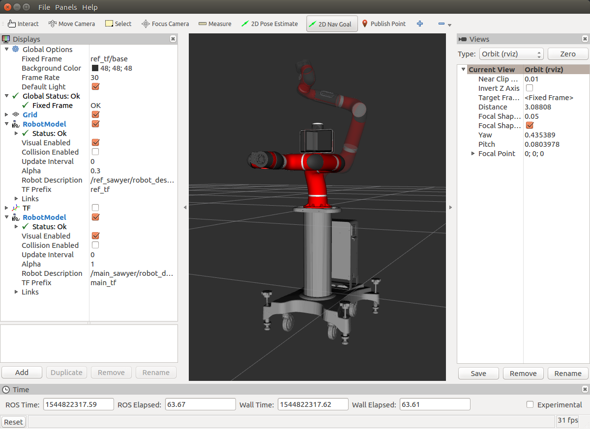
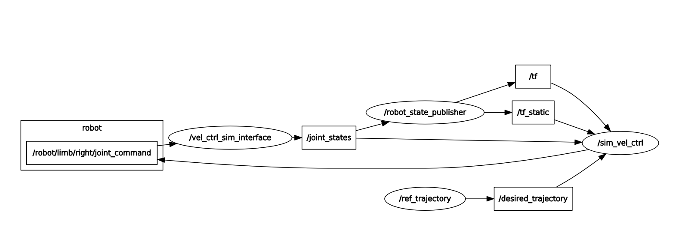

# Sawyer Velocity Control

## Summary
This package is used to apply task-space velocity control to Rethink Robotic's Sawyer
to follow a specified trajectory.

Launch files in this package are set up such that one can either simulate velocity
control using RViz, or apply velocity control to a Sawyer robot in real world applications.

This package can also make use of an ATI Force/Torque sensor attached to Sawyer's
end effector. Readings from this sensor are fed into a control loop which generates
trajectories. These trajectories are used to approximate the behaviors of true interaction
and hybrid motion-force controllers.

## Package Details
### Launch Files
#### `joint_states_gui.Launch`
* Loads Sawyer's URDF from xacro files found in the `sawyer_description` package.
Starts the `joint_state_publisher` with an interactive gui along with RViz.
Used as a check to make sure things are installed properly. Also helpful for
quickly visualizing Sawyer in various configurations.

#### `rand_ref_vel_ctrl.launch`
* Begins by loading a reference sawyer with a randomly chosen configuration under
the name space `ref_sawyer`. This starts the `ref_js_randomizer` node which
publishes the randomized reference `JointState` message from `ref_sawyer`.
The `ref_vel_ctrl` node is then started in the `main_sawyer` name space. This
node produces a separate simulated sawyer in its home configuration.

* Next, a fixed transform between the `ref_sawyer` base frame and the `main_sawyer`
base is published on a `static_transform_publisher` node.

* Finally, RViz is started. In RViz, the slightly transparent `ref_sawyer` can be seen in its randomly
selected configuration. `main_sawyer` is shown superimposed on `ref_sawyer` without
transparency. Upon user input, the `main_sawyer/ref_vel_ctrl` node begins a velocity
control loop with drives `main_sawyer`'s end-effector to `ref_sawyer`'s randomly
selected end effector pose. The following figure shows a screencapture of this launch file running.

* The nodes used in this launch file were used as a frame work for the remainder of the
project.

#### `sim_vel_ctrl.launch`

* This launch file simulates velocity control of Rethink Robotics Sawyer. The control loop,
found in `sim_vel_ctrl.py`, subscribes to a `TransformStamped` message published on the
`/desired_trajectory` by the `/ref_trajectory` node. The trajectory published by this node
can be specified in `traj_gen.py`, as described in more detail further down.

* `sim_vel_ctrl.py` calculates the joint velocities necessary to drive the simulated
end effector to the most recent message published on topic `/desired_trajectory`.
It then publishes these commands as a `intera_core_msgs/JointCommand` message on
the `/robot/limb/right/joint_command` topic. This is the same topic and message
type used on Sawyer in real world use.

* The simulated nature of this process means we have to calculate Sawyer's joint states
from the velocity commands, since there is no real Sawyer to retrieve the joint states from.
This is handled by the `vel_ctrl_sim_interface` node. Found in `vel_ctrl_sim_interface.py`,
this node unpacks the `intera_core_msgs/JointCommand` message found on the
`/robot/limb/right/joint_command` topic. It then interpolates the simulated
Sawyer's joint positions and publishes them on the `/joint_states` topic. This is
the `/joint_states` topic that the `robot_state_publisher` subscribes to for tf calculations.

* The end result of running this launch file is an RViz instance where a simulated
Sawyer can be seen following the trajectory specified in `traj_gen.py`

* Though unnecessary for real world use, this launch file is incredibly useful
for visualizing the velocity control loop when used with `rqt_graph`. Since using
`rqt_graph` while connected to the real world Sawyer is a bad idea because of the sheer
number of running nodes and topics, use in this simulated version shows a clean loop
representing (approximately) how the real world control loop will work. The following image is
a screen capture of `rqt_graph` captured while running this launch file.

#### `sawyer_vel_ctrl.launch`

* This launch file is the first non-simulation launch file in this package. Running
this launch file while connected to Sawyer will drive the real-world Sawyer's end effector
to the trajectory specified in `traj_gen.py`

* A fair amount of cautious respect should be given when running Sawyer in velocity control
mode. The velocity limits on Sawyer's joints are surprisingly high and can cause damage
or injury if this launch file is used with out some level of care. To prevent damage, 
